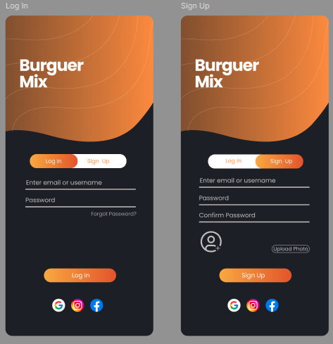
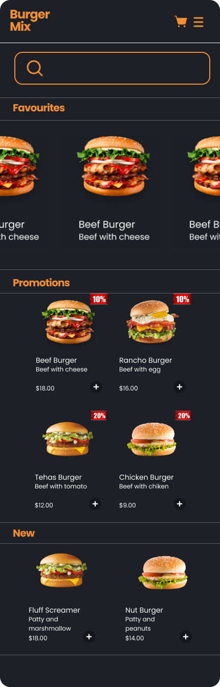
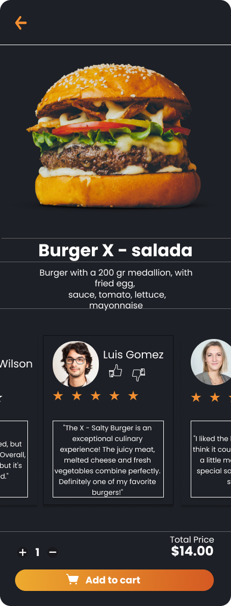
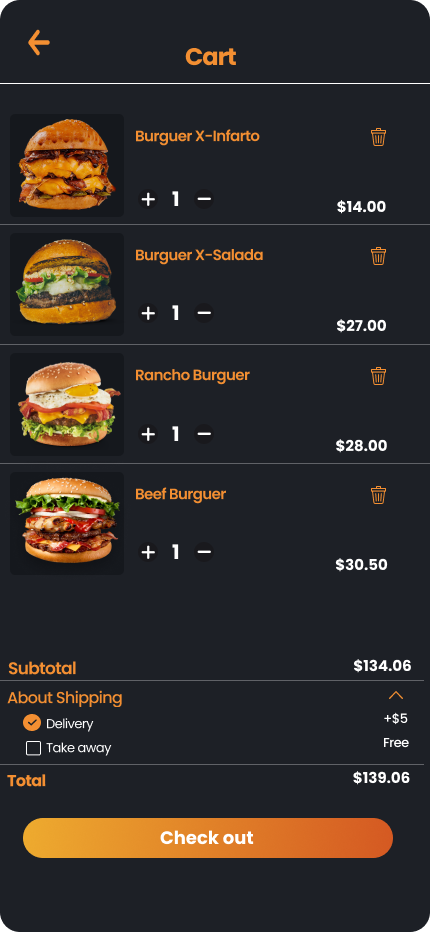
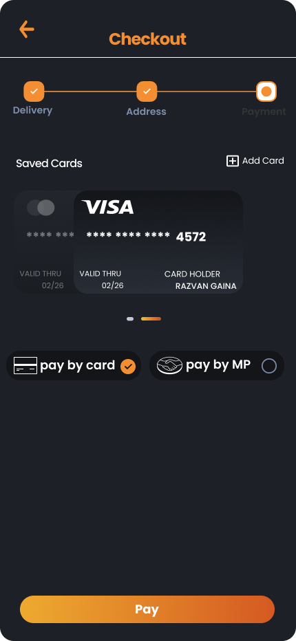

# Diseño UI/UX de Aplicación Móvil para Tienda de Hamburguesas

## Introducción

Como parte de mi introducción al diseño UI/UX, he realizado un diseño en Figma de una aplicación móvil para una tienda de hamburguesas. Este proyecto tiene como objetivo mostrar mis habilidades y conocimientos básicos en el diseño de interfaces de usuario y experiencia de usuario.

## Descripción del Proyecto

El diseño de la aplicación móvil se centra en proporcionar una experiencia de usuario intuitiva y atractiva para los clientes de una tienda de hamburguesas. Incluye las siguientes características:

- **Pantalla de Inicio:** Presenta una vista general de las promociones y novedades de la tienda.
- **Menú de Hamburguesas:** Muestra una lista de hamburguesas disponibles con imágenes, descripciones y precios.
- **Detalles de Producto:** Proporciona información detallada sobre cada hamburguesa, incluyendo ingredientes y opciones de personalización.
- **Carrito de Compras:** Permite a los usuarios revisar y modificar su pedido antes de realizar la compra.
- **Proceso de Pago:** Facilita la finalización del pedido mediante una interfaz de pago sencilla y segura.

## Herramientas Utilizadas

- **Figma:** Utilizado para crear el diseño de la interfaz de usuario y los prototipos interactivos.

## Capturas de Pantalla

A continuación, se presentan algunas capturas de pantalla del diseño de la aplicación móvil:

## Cómo Ver el Diseño

Puedes ver el diseño completo y el prototipo interactivo en Figma siguiendo este enlace: [Enlace al Diseño en Figma](https://www.figma.com/design/CBMKuDRVOCcV7BMsWfLWej/Dise%C3%B1o-UX%2FUI?node-id=0-1&t=JnOGFcDHyuVtD7dm-0).

## Conclusión

Este proyecto me ha permitido aplicar los conceptos fundamentales de diseño UI/UX en un proyecto práctico.
